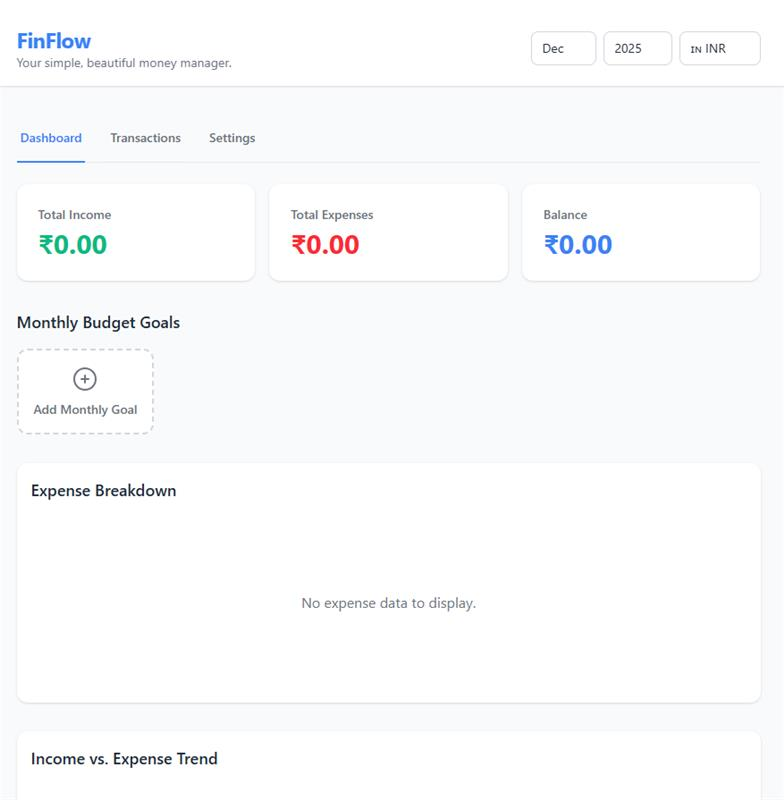

# FinFlow - Minimalist Money Manager

<div align="center">
  <h3>Track Your Income & Expenses Effortlessly</h3>
  <p>A clean, minimalist personal finance application to manage your money with ease.</p>
</div>

<div align="center">
  
</div>

## Features

- 💰 **Track Income & Expenses** - Record all your financial transactions with ease
- 📊 **Visual Analytics** - Beautiful charts to visualize your spending habits
- 🎯 **Budget Goals** - Set and track budget goals by category
- 🏷️ **Custom Categories** - Create and organize your own categories
- 📱 **PWA Ready** - Works offline and can be installed as a mobile app
- 💾 **Data Export** - Export your transactions as CSV for external analysis
- 🔄 **Backup & Restore** - Backup and restore all your data (transactions, categories, budgets) as JSON
- 🌍 **Multi-Currency** - Support for USD, INR, EUR, and AED

## Getting Started

### Prerequisites

- Node.js 18+ installed on your system
- npm or yarn package manager

### Installation

1. Clone the repository:
   ```bash
   git clone https://github.com/ameerzain/finflow.git
   cd finflow
   ```

2. Install dependencies:
   ```bash
   npm install
   ```

3. Start the development server:
   ```bash
   npm run dev
   ```

4. Open your browser and navigate to `http://localhost:3000`

## Building for Production

### Web Build

To create a production build:

```bash
npm run build
```

The production build will be in the `dist` directory. You can preview it with:

```bash
npm run preview
```

### Deploying to Production

The built application can be deployed to any static hosting service:

- **Vercel**: Connect your GitHub repository and deploy
- **Netlify**: Drag and drop the `dist` folder or connect via Git
- **GitHub Pages**: Use GitHub Actions to build and deploy
- **Firebase Hosting**: Use Firebase CLI to deploy

### Progressive Web App (PWA)

This app is configured as a Progressive Web App and can be installed directly from your browser:

- **Install on Mobile**: Open the app in your mobile browser and use "Add to Home Screen"
- **Install on Desktop**: Use the install prompt in supported browsers (Chrome, Edge, etc.)
- **Offline Support**: The app works offline once installed as a PWA

For native mobile app deployment, you can use tools like:
- **Capacitor**: Wrap the PWA as a native mobile app
- **PWA Builder**: For easy PWA distribution

## Project Structure

```
finflow/
├── components/          # React components
│   ├── Dashboard.tsx
│   ├── TransactionList.tsx
│   ├── Settings.tsx
│   ├── BudgetTracker.tsx
│   ├── Categories.tsx
│   ├── icons/          # SVG icon components
│   └── ...
├── hooks/              # Custom React hooks
│   └── useLocalStorage.ts
├── public/             # Static assets
│   └── manifest.json   # PWA manifest
├── types.ts            # TypeScript type definitions
├── constants.ts        # App constants and defaults
├── App.tsx             # Main application component
├── index.tsx           # Application entry point
├── index.html          # HTML template
├── index.css           # Global styles
├── vite.config.ts      # Vite configuration
├── tailwind.config.js  # Tailwind CSS configuration
└── tsconfig.json       # TypeScript configuration
```

## Technology Stack

- **React 19** - UI framework
- **TypeScript** - Type safety
- **Vite** - Build tool and dev server
- **Tailwind CSS** - Styling
- **Recharts** - Data visualization
- **LocalStorage** - Data persistence

## Data Storage

All user data is stored locally in the browser's localStorage. This means:
- ✅ Data never leaves your device
- ✅ Works completely offline
- ✅ No account or login required
- ⚠️ Data is browser-specific (clearing browser data will delete it)

Users can export their data in two formats:
- **CSV Export**: Export transactions only (from the Transactions tab) for spreadsheet analysis
- **JSON Backup**: Export all data (transactions, categories, budgets, currency) for complete backup and restore

## Contributing

Contributions are welcome! Please feel free to submit a Pull Request. For major changes, please open an issue first to discuss what you would like to change.

1. Fork the repository
2. Create your feature branch (`git checkout -b feature/AmazingFeature`)
3. Commit your changes (`git commit -m 'Add some AmazingFeature'`)
4. Push to the branch (`git push origin feature/AmazingFeature`)
5. Open a Pull Request

## Author

**Ameer Zain**

- GitHub: [@ameerzain](https://github.com/ameerzain)
- LinkedIn: [Ameer Zain](https://www.linkedin.com/in/ameer-zain)

## License

This project is open source and available under the [MIT License](LICENSE).

## Support

For issues, questions, or feature requests, please create an issue in the repository.
